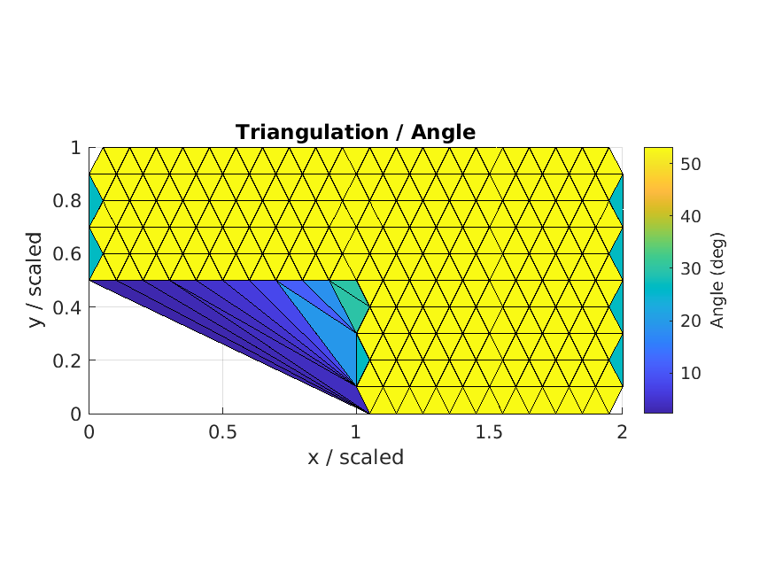
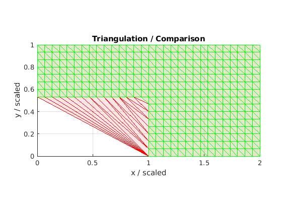
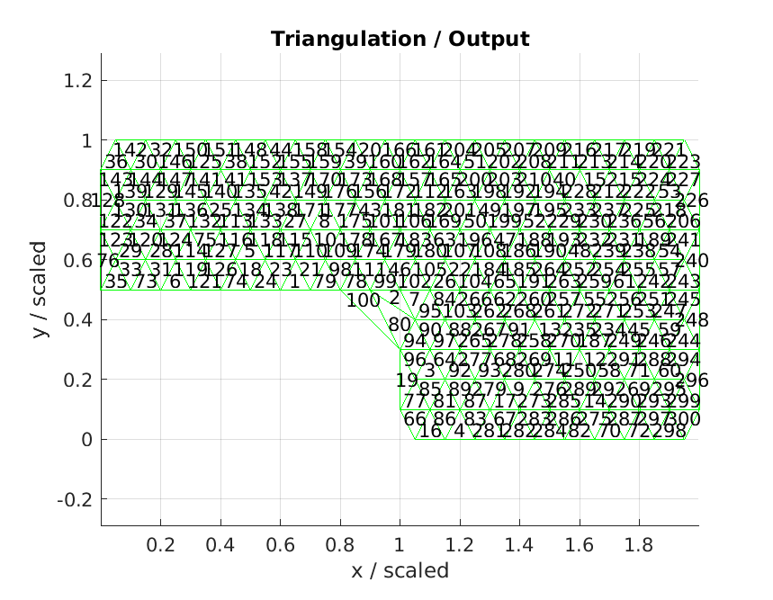
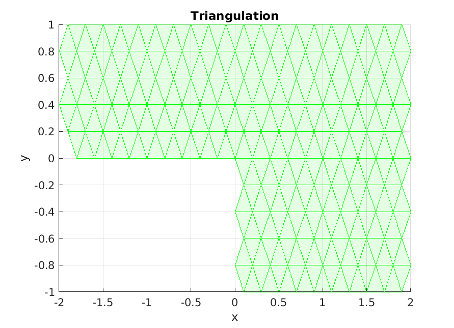
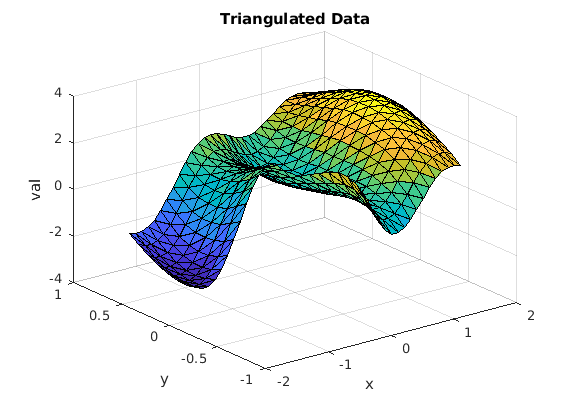
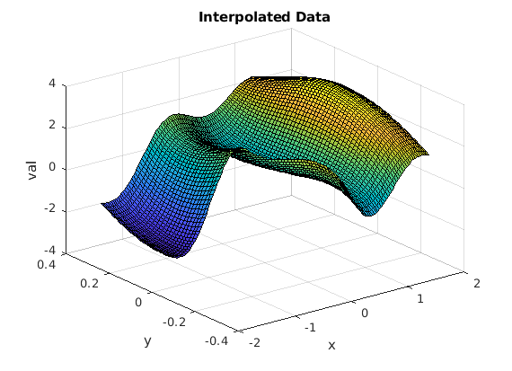

# MATLAB Code for Interpolating Triangulated Data

The **MATLAB code** offers several functions for creating **2D triangulations** and **interpolating** data:
* creating **triangulation** from **scattered data**, using **alpha shapes**
    * handle ill-conditioned triangles
    * handle multiple (disjoint) domains
    * handle holes in the domains
* removing **ill-conditioned triangles**
    * skinny triangles on the exterior boundary 
    * triangles specified with a list of indices
* computing the **area** and the **angle** of the triangles
* **linear interpolation** on a specified triangulation
* **plotting** triangulation geometry and data

## Examples

### Angles and Ill-conditioned Triangles

    
    

    
    

### Triangulated and Interpolated Data

    
    

## Compatibility

* Tested with MATLAB R2021a.
* No toolboxes are required.
* Compatibility with GNU Octave not tested but probably easy to achieve.

## Author

**Thomas Guillod** - [GitHub Profile](https://github.com/otvam)

## License

This project is licensed under the **BSD License**, see [LICENSE.md](LICENSE.md).
